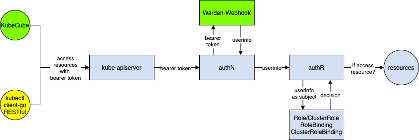
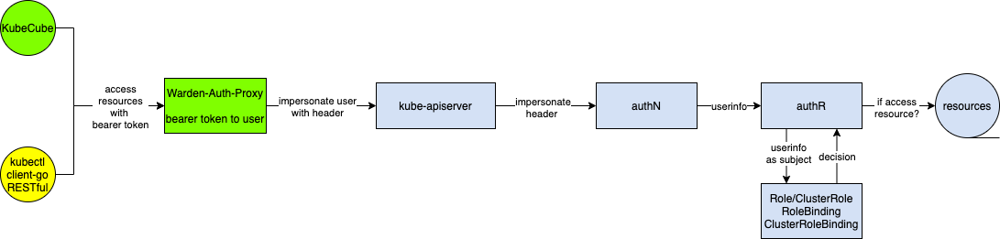
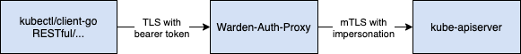

KubeCube 迎来了 v1.1 版本的发布，新增了 OAuth2 的 GitHub 登录支持、租户配额的算法优化、Warden 热插拔安装包的本地和远端拉取支持等新的特性，也修复了若干已知问题，详见 [ChangeLog](https://github.com/kubecube-io/KubeCube/blob/release-v1.1/docs/changelog.md)。

v1.1 版本中最主要的特性是 Auth-Proxy 能力的支持，使得部署更加轻量，无需侵入修改 kube-apiserver 的配置。用户可以使用 RESTful、client-go、kubectl 等方式访问被 KubeCube 纳管的 K8s 集群，享受统一的认证能力。

## 使用 Auth-Webhook 的困境



在 KubeCube v1.1 版本之前，KubeCube 使用 K8s 提供的 Auth-Webook 方式来拓展认证能力，该方式通过为 kube-apiserver 指定认证后端来达到认证拓展的目的，kube-apiserver 会使用认证 Webhook 返回的 UserInfo 去进行下一步的鉴权流程。

该方式虽然能够使用 K8s 原生的方式拓展认证能力，但是在实际使用中存在一定的不足。如 [Issues#62](https://github.com/kubecube-io/KubeCube/issues/62) 中所指出的，该方式需要修改 kube-apiserver 的启动参数，为其[指定额外的认证 Webhook 后端](https://kubernetes.io/zh/docs/reference/access-authn-authz/authentication/#webhook-token-authentication)，当我们的 K8s 集群是多 Master 节点的高可用集群时，需要修改每一个 Master 节点的 kube-apiserver 的配置，这在很多场景几乎是无法接受的。另外在一些云厂商的托管 K8s 场景下，往往只对用户提供工作节点，此时想修改 kube-apiserver 的配置是非常困难的。

## Warden-Auth-Proxy



对于 Auth-Webhook  面临的困境，我们设计了 Warden-Auth-Proxy 模块来解决问题。Warden-Auth-Proxy 即 K8s 集群的认证代理，它对外提供了类似 `kubectl proxy` 的代理能力。不同的是，它会解析 request 中的 Bearer Token 为 UserInfo，然后使用 K8s 的 [impersonation 能力](https://kubernetes.io/zh/docs/reference/access-authn-authz/authentication/#user-impersonation)进行用户伪装。

值得一提的是，Auth-Proxy 模块之所以集成在作为 Cluster Agent 的 Warden 中，而不是集成在管控集群的 KubeCube 中，是因为在设计上希望做到两点：

1. 对于各个集群的请求能够就近访问本集群的代理服务，而不是跨集群访问 KubeCube 中的代理服务。
2. 即使当 KubeCube 发生 Crash 的时候，各个集群的认证鉴权能力依然能够保持正常。

Auth-Proxy 的原理并不复杂，但是在实现中，需要注意以下几个问题：

### 1. kubectl exec 命令代理

不同于其他的 HTTP RESTful 请求，`kubectl exec` 命令实际是使用的 [SPDY 协议](https://en.wikipedia.org/wiki/SPDY)，SPDY 协议是 google 开发的 TCP 会话层协议, SPDY 协议中将 HTTP 的 request/response 称为 Stream，并支持 TCP 的链接复用，同时多个 stream之间通过 stream-id 来进行标记，简单来说就是支持在单个链接同时进行多个请求响应的处理，并且互不影响 。

在代理 `kubectl exec` 请求时，需要 Upgrade HTTP 协议，即通过 101(switching protocal) 状态码切换至 SPDY 协议来继续与下游服务通信。

```go
func (h *UpgradeAwareHandler) ServeHTTP(w http.ResponseWriter, req *http.Request) {
  // 尝试协议 upgrade
  if h.tryUpgrade(w, req) {
		return
	}
	if h.UpgradeRequired {
		h.Responder.Error(w, req, errors.NewBadRequest("Upgrade request required"))
		return
	}

  ...

  // 构建 golang 经典的 ReverseProxy
	proxy := httputil.NewSingleHostReverseProxy(&url.URL{Scheme: h.Location.Scheme, Host: h.Location.Host})
	proxy.Transport = h.Transport
	proxy.FlushInterval = h.FlushInterval
	proxy.ErrorLog = log.New(noSuppressPanicError{}, "", log.LstdFlags)
	if h.Responder != nil {
		proxy.ErrorHandler = h.Responder.Error
	}
	proxy.ServeHTTP(w, newReq)
}
```

### 2. kubeconfig

要实现对于 RESTful 请求的代理，只需保证 HTTP Client 的请求地址是 Warden-Auth-Proxy 的地址即可。但是对于使用 kubectl 来说，我们需要在 kubeconfig 上做文章。

KubeCube 提供下载 kubeconfig  的能力，使用当前 user 下载的 kubeconfig，包含了 user 的访问凭证，包含了该 user 所能访问的所有 cluster  的 context，user 可以自行切换 context 来对 KubeCube 纳管的集群进行访问。KubeCube 通过改写 kubeconfig 中的 kube-apiserver 地址为 Warden-Auth-Proxy 地址来使得用户通过该 kubeconfig 执行的 kubectl 请求会被 Warden-Auth-Proxy 所代理。

```yaml
apiVersion: v1
clusters:
- cluster:
    certificate-authority-data: {member_1_cluster_ca_data}
    server: {member_1_warden_auth_proxy_addr}
  name: member-1
- cluster:
    certificate-authority-data: {pivot_cluster_ca_data}
    server: {pivot_warden_auth_proxy_addr}
  name: pivot-cluster
contexts:
- context:
    cluster: member-1
    user: member-1-admin
  name: member-1-admin@member-1
- context:
    cluster: pivot-cluster
    user: pivot-cluster-admin
  name: pivot-cluster-admin@pivot-cluster
current-context: member-1-admin@member-1
kind: Config
users:
- name: member-1-admin
  user:
    token: {user_token}
- name: pivot-cluster-admin
  user:
    token: {user_token}
```

### 3. security



- KubeCube 使用 Bearer Token 作为用户访问凭证，Invalid Bearer Token 会被 Warden-Auth-Proxy 拒绝。
- 应使用 TLS 对 Warden-Auth-Proxy 进行服务端身份校验，需要相应的 CA 证书，该 TLS 能力在规划中，还未支持，当前使用 `insecure-skip-tls-verify` 跳过，在后续版本中，会增加对 TLS 能力的支持。
- Warden-Auth-Proxy 与 kube-apiserver 之间，通过 mTLS 进行双向加密通信，Warden-Auth-Proxy 持有 K8s 集群的 admin 证书，并以 admin 身份伪装成目标 user 与 kube-apiserver 进行通信。

## 写在最后

未来我们会持续提供更多功能，帮助企业简化容器化落地。也欢迎大家参与贡献，提出宝贵的建议。添加以下微信进入 KubeCube 交流群。


**作者简介：** 蔡鑫涛，网易数帆轻舟容器平台资深开发，KubeCube 核心 Committer

