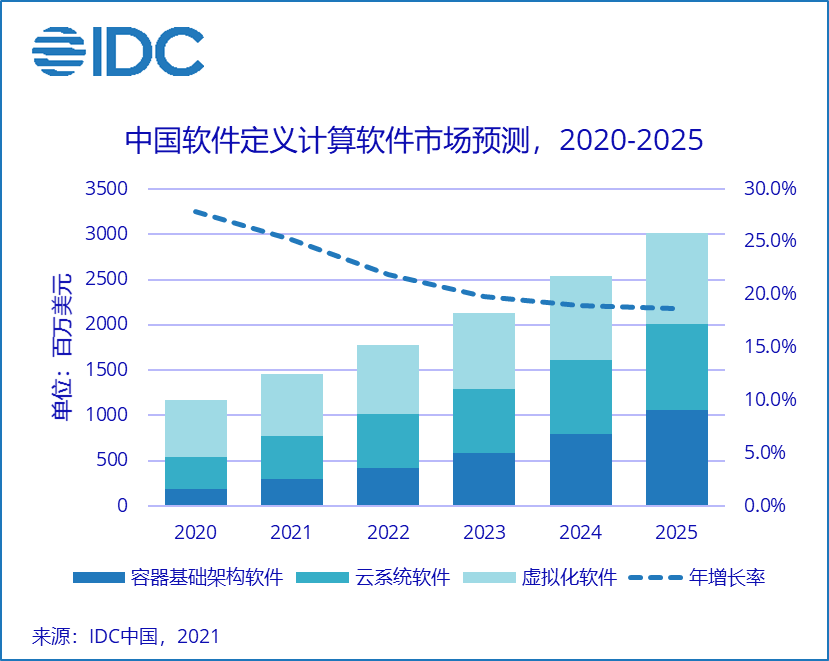
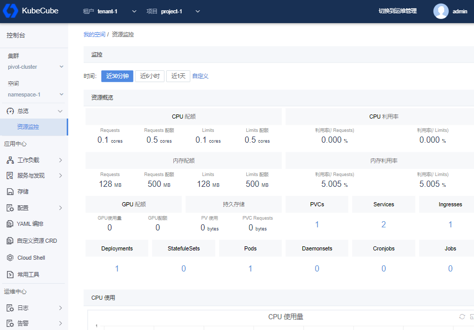
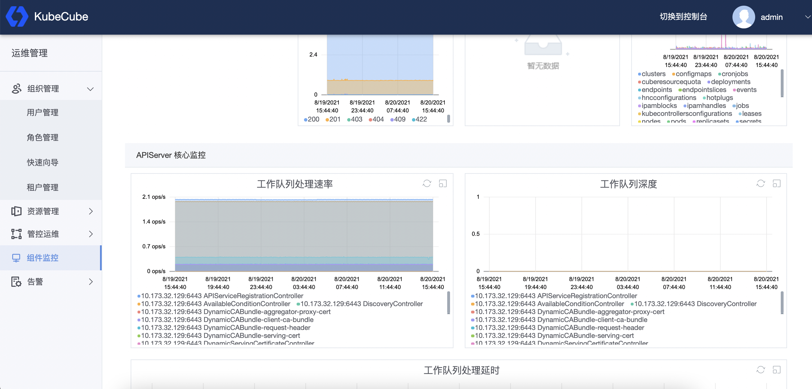
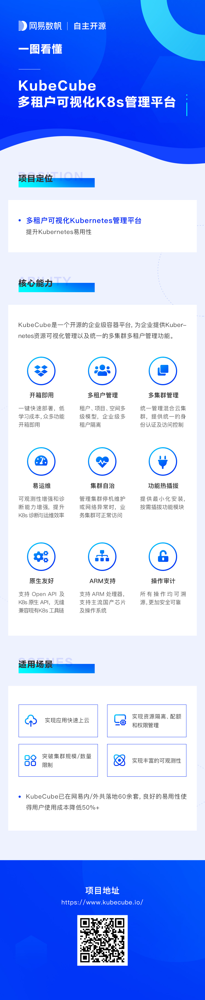

容器技术发展至今，各行各业对其所带来的好处，如多环境交付一致性、弹性伸缩、故障自愈等，已经达成普遍共识。这些好处的实现，依赖于当前容器编排领域的事实标准——Kubernetes平台。然而，Kubernetes的复杂性、学习曲线陡峭也是不争的事实，这对容器技术落地应用造成很大影响。

根据IDC最新发布的软件定义计算软件市场半年跟踪报告显示，容器软件市场在未来五年仍然会保持超过40%的复合增长率，但 2020 年容器基础架构软件占整体软件定义计算市场的比例仅为16.2%。容器在互联网、金融、AI 等领域已经规模落地，大批头部企业已经基于容器构建新一代企业基础设施平台，但在多数传统企业、中小型企业落地率并不高。

这其中的原因，很大程度上是因为企业在落地容器技术时所面临的各种问题，导致落地成本较高，比如：

* Kubernetes学习曲线陡峭，配置复杂度高：Kubernetes是一个强大的容器编排系统，但不可否认它也是一个很复杂的分布式系统，其学习门槛高，学习曲线较长，企业需要具备较丰富的经验才能很好的使用和维护Kubernetes集群。这就需要企业付出不小的人力成本及时间成本，对很多中小型企业来说，这个成本是不容小觑的。
* 单Kubernetes集群无法满足企业需求，多集群管理效率低：我们接触到的不少客户在生产级容器化落地时，发现单个Kubernetes集群根本无法满足需求，典型的场景是需要开发、测试、演练、预发、生产等多种环境，线下环境需要与线上环境进行隔离，这就需要使用多个Kubernetes集群，独立操作多个Kubernetes集群的效率问题就体现出来了。
* 不能较小代价的获得企业落地所需的特性：企业选择Kubernetes，目标还是想利用Kubernetes实现降本、增效，因此多个部门或者同部门下多项目组共享资源是很常见的场景，但还需要不同项目保持必要的隔离性，保证租户之间公平地分配共享集群资源。并且Kubernetes专注于单集群单租户容器编排能力，虽然社区有相关的项目，但在生产级落地使用还是有较高的门槛。
* 监控、告警、日志等可观测方面需要建设：社区主流的监控方案是Prometheus、告警是AlertManager、日志方案较多，但使用时配置较复杂，维护难度也较高，这就提升了对运维、研发的要求，势必会影响业务研发的效率。
* 国产化支持：近几年国际环境的变化，让我们更进一步认识到了自主可控的重要性，企业底层环境越来越多采用国产处理器、国产操作系统，而容器化涉及的系统，并不是全部支持国产“芯”，这也成为一个影响容器化落地的因素。

## KubeCube开源

为了帮助企业加快容器化落地进程，网易数帆将沉淀多年的容器平台KubeCube开源，希望为新基建做出一份贡献，同时希望以此促进国内相关领域的创新，打造国内开放、安全、自主可控的云原生底座，关键时刻，不会被人“卡脖子”。

KubeCube (https://kubecube.io) 是一个轻量化的企业级容器平台，为企业提供kubernetes资源可视化管理以及统一的多集群多租户管理功能，具有简化应用部署、管理应用的生命周期和丰富的监控和日志审计能力。Cube有魔方之意，寓意通过KubeCube的能力组合，企业可以快速构建一个强大和功能丰富的云原生底座，并增强 DevOps 团队的能力。下面我们具体来看KubeCube这个魔方的六面，都提供了哪些能力。

### 一键部署

KubeCube针对用户的使用场景提供了多种部署方式：适用于POC环境的[All In One部署](https://www.kubecube.io/docs/installation-guide/all-in-one/)，适用于生产环境的[多节点高可用部署](https://www.kubecube.io/docs/installation-guide/install-on-multi-node/)。仅需要一条命令即可完成 Kubernetes+KubeCube 的部署，同时提供了开箱即用的多集群管理、多租户、可观测功能。

同时考虑到企业可能已有部分能力建设，如日志平台等，KubeCube可以只部署核心服务，提供多集群多租户能力，可观测等组件可以通过热插拔的方式开启或关闭，同时通过热插拔配置完成用户已有系统对接，用户可以根据实际场景灵活选择。

通过提供Kubernetes资源可视化管理，降低用户的学习曲线，除扩展了必要的企业特性如多租户等能力，其他贴近原生，使用户的学习路线没有断层。

### 多Kubernetes集群统一管理

KubeCube可以接管任意标准Kubernetes集群，对接管的所有Kubernetes集群提供统一的用户管理和基于Kubernetes原生RBAC扩展的访问控制。为提升用户管理多个Kubernetes集群的效率，KubeCube提供了在线运维工具，可以通过KubeCube这一统一入口，快速管理多集群资源：CloudShell可以在线对各集群使用`kubectl`，WebConsole可以在线访问各集群中的Pod。

另外，考虑到混合云场景下KubeCube管控集群与业务集群间的网络抖动、异常等问题。我们提供了业务集群自治能力，当业务集群与KubeCube管控集群失联时，业务集群的访问控制等可正常生效，不会受到影响。

### 多租户隔离

在我们跟企业交流时，发现不同企业虽然规模不一样，但选择进行容器化的初衷还是为了降本增效、很多企业会选择多个部门共用Kubernetes集群或者物理资源，在共享资源的同时，希望有足够的隔离性。

因此KubeCube基于HNC进行了部分扩展，提供租户、项目、空间3层模型，以满足不同规模企业的组织架构层级，并以此提供资源可见性隔离、配额控制等。使企业不同部门通过共享降低成本的同时，保证必要的隔离，防止恶意操作带来的风险。

### 完全兼容原生 Kubernetes API

KubeCube除能够通过UI管理Kubernetes资源外，还提供了OpenAPI以及Kubernetes API访问（可以使用`kubectl`、`client-go`直接访问集群），所有访问方式均通过统一的身份认证及权限访问控制。通过OpenAPI可以方便的与企业已有系统进行集成，如果企业已有部分能力建设，如使用`kubectl`的运维脚本等，都可以无缝迁移。

### 开箱即用的可观测功能

提供日志、监控、告警功能，提升问题定位及运维效率，可视化配置，告别复杂的配置规则。

提供多维度基础指标监控，覆盖集群、物理节点、工作负载等多种维度，提供CPU、内存、磁盘、网络、GPU等常用指标，满足日常运维需求，帮助用户快速发现、定位问题。

基于自研的日志配置分发服务，动态感知Pod变化，使日志采集对业务无侵入，同时可减少资源占用，降低成本。

### ARM及国产化支持

KubeCube支持AMD及ARM架构，同时支持目前主流的国产处理器及操作系统，如飞腾处理器、麒麟操作系统等。

## 一图看懂KubeCube

以上是KubeCube的六大特性介绍。我们在下图中更全面地总结了KubeCube的核心信息，可以帮助大家更好地了解KubeCube的能力和用途。

## 写在最后

未来我们会持续提供更多功能，帮助企业简化容器化落地。也欢迎大家的宝贵建议，添加以下微信进入KubeCube交流群。

**作者简介：** 祝剑锋，网易数帆轻舟容器平台负责人，KubeCube社区核心维护者，主导KubeCube容器平台的开源工作，负责网易数帆轻舟容器平台集团内大规模落地及产品化建设。具有六年Kubernetes及容器平台相关研发及大规模实践经验。