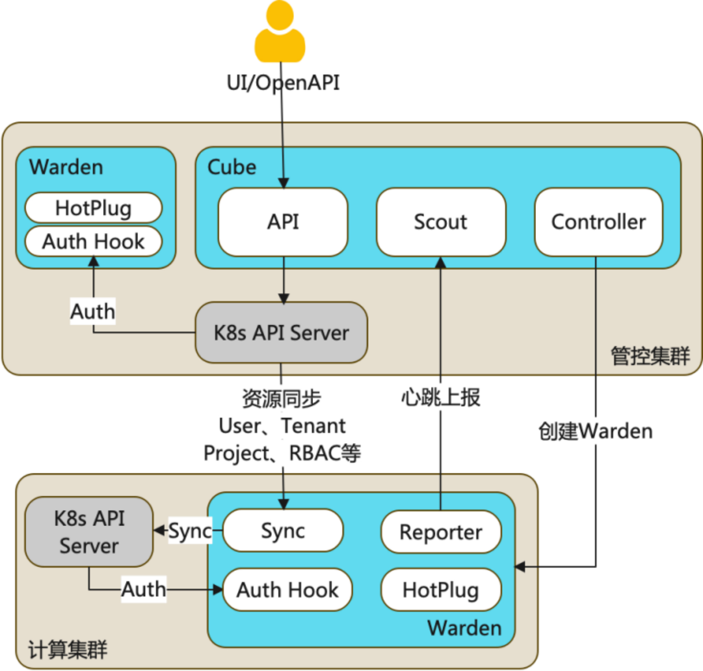
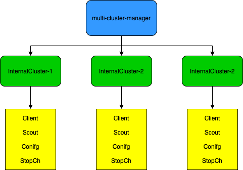
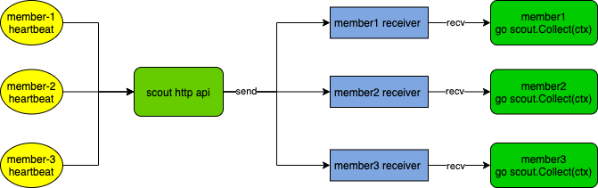
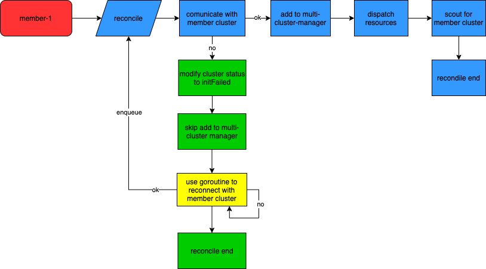
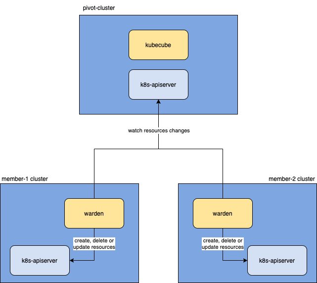
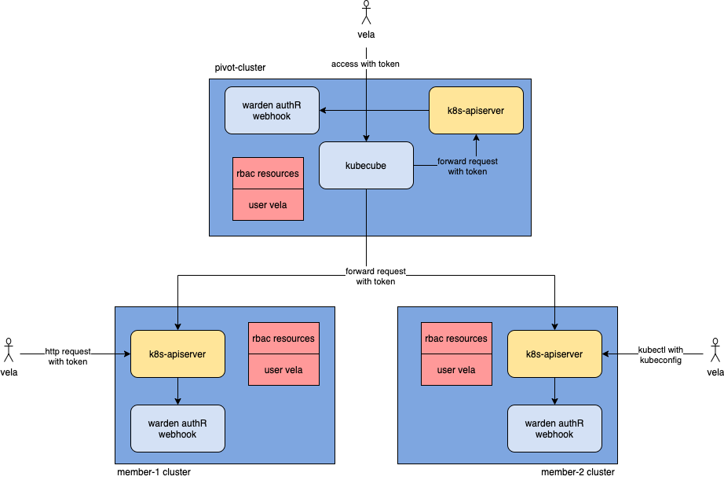

**为什么需要多集群？**

- 生产级落地，需要经过多个环境验证，单个集群往往不能满足隔离需求
- 当业务规模超过了单集群的承载能力时
- 当企业考虑使用多云或者混合云架构时
- 当架构设计上考虑云容灾，异地多活等场景时

**k8s 多集群管理现状**

多集群管理并不是 kubernetes 社区的一个主要目标，虽然社区提出了 mcs 的多集群 service 标准，但是这依然无法满足企业想要管理多集群的需求。如果仅仅使用 k8s 原生的能力进行多集群建设，k8s 管理者往往需要管理大量的不同 k8s 集群的配置文件，需要管理不同用户的认证以及权限信息，并且对于应用的多集群发布、运维需要大量的人工的介入，很容易出现**配置管理混乱、因操作不当导致故障**等问题

**KubeCube 多集群能力**

KubeCube 可以接管任意标准 Kubernetes 集群，对接管的所有 Kubernetes 集群提供统一的用户管理和基于 Kubernetes 原生 RBAC 扩展的访问控制。为提升用户管理多个Kubernetes集群的效率，KubeCube提供了在线运维工具，可以通过KubeCube这一统一入口，快速管理多集群资源：CloudShell 可以在线对各集群使用`kubectl`，WebConsole 可以在线访问各集群中的Pod

另外，考虑到混合云场景下 KubeCube 管控集群与业务集群间的网络抖动、异常等问题。我们提供了业务集群自治能力，当业务集群与KubeCube管控集群失联时，业务集群的访问控制等可正常生效，不会受到影响

## KubeCube 的多集群模型



KubeCube 基于多集群模型，实现了**多集群管理能力**，**多集群统一认证和鉴权的能力**，**多集群多租户管理能力**以及**多集群的容错能力**，了解多集群模型能够帮助你更加深入地了解 KubeCube。下文会对 KubeCube 和 Warden 中的各个多集群模块的设计进行探索。

## KubeCube 中的多集群模块

KubeCube 是管控集群上的核心组件，它实现了多集群的生命周期管理，同时也作为 UI/openAPI 的操作入口。了解 KubeCube 中的多集群模块，我们需要关注以下几个 topic

1. cluster cr 与 InternalCluster 的关系
2. multi-cluster-manager 如何管理 InternalCluster
3. cluster reconcile 的流程
4. scout 如何侦查计算集群的心跳

### Multi-Cluster-Manager -- 多集群管理器



多集群管理器本质上就是对`InternalCluster`的管理，接口中包含了操作`InternalCluster`的所需方法

```go
// MultiClustersManager access to internal cluster
type MultiClustersManager interface {
	// Add runtime cache in memory
	Add(cluster string, internalCluster *InternalCluster) error
	Get(cluster string) (*InternalCluster, error)
	Del(cluster string) error

	// FuzzyCopy return fuzzy cluster of raw
	FuzzyCopy() map[string]*FuzzyCluster

	// ScoutFor scout heartbeat for warden
	ScoutFor(ctx context.Context, cluster string) error

	// GetClient get client for cluster
	GetClient(cluster string) (kubernetes.Client, error)
}
```

`InternalCluster` 是真实`Cluster`cr 的运行时映射，`Cluster`cr 代表了被`KubeCube`纳管的集群。

`InternalCluster` 包含四个字段：

- **Client** 包含了沟通指定集群所需的所有 k8s client，包括`sig/client-go`中的`clientset`，`sig/controller-manager`中的`client.Client`和`cache.Cache`，以及`k8s.io/metric`中的`clientset`，通过 `Client`，我们可以以各种姿势沟通不同 k8s 集群的 k8s-apiserver，这也是实现多集群的基础

```go
type Client interface {
	Cache() cache.Cache
	Direct() client.Client
	Metrics() versioned.Interface
	ClientSet() kubernetes.Interface
}
```

- **Scout** 为探测指定集群健康状况的侦察员，在下文会详细阐述
- **Config** 为沟通指定集群所需的`rest.Config`，由 `Cluster`cr 中的 `KubeConfig` 转化而来
- **StopCh** 是用来关闭 `Scout`对指定集群的侦查行为，以及停止与该集群相关的所有`informer`行为

### Scout -- 计算集群侦查员



scout 的职责是侦查指定集群的健康状况，它对外提供 http 接口来接收来自不同集群的心跳，随后将心跳包发送到对应的 scout 的 Receiver channel 中，对内则是起了一个 goroutine 循环接收来自 Receiver channel 的心跳包，并且根据健康和超时两种情况做不同的 callback 处理。

```golang
// Collect will scout a specified warden of cluster
func (s *Scout) Collect(ctx context.Context) {
	for {
		select {
		case info := <-s.Receiver:
			s.healthWarden(ctx, info)

		case <-time.Tick(time.Duration(s.WaitTimeoutSeconds) * time.Second):
			s.illWarden(ctx)

		case <-ctx.Done():
			clog.Warn("scout of %v warden stopped: %v", s.Cluster, ctx.Err())
			return
		}
	}
}
```

### Cluster-Controller -- 集群 cr 控制器



Cluster 的 controller 主要负责感知 KubeCube 纳管的集群变更，并且初始化计算集群的相关设置

1. watch 到新的 cluster cr 的 create 事件
2. 尝试使用 cluster cr 中的元信息去沟通对应 k8s 集群的 apiserver
3. 如果与对应的 k8s 集群建联失败，则会使该事件进入 retry 队列（详见下文的多集群容错）
4. 与 k8s 集群建联成功后会创建对应的`InternalCluster`，并将其添加到`MultiClustersManager`管理的缓存中
5. 向对应的集群下方 warden 的 deployment 以及一些必要的 crd 资源
6. 创建该集群对应的 scout，并开启对该集群的侦查

## Warden 中的多集群模块

Warden 是作为一种 cluster agent 的身份存在于每个计算集群中，它提供了计算集群与管控集群之间的资源同步能力、热插拔能力、统一鉴权的能力、资源配置管理能力、心跳上报能力等等。了解 warden 中的多集群模块，我们需要关注以下几个 topic

1. warden 如何向管控集群上报心跳信息
2. warden 如何从管控集群同步资源

### Reporter -- 集群信息上报者

Warden 的 reporter 上报者是与 KubeCube 的 scout 侦察员一一对应，遥相呼应的

Warden 需要会在启动时根据已注册的健康检查方法去检查各个模块的健康状态，等到它所依赖的各个模块都达到健康状态后，才会开始向管控集群上报心跳，如果健康检查超时，warden 将会启动失败

```go
// waitForReady wait all components of warden ready
func (r *Reporter) waitForReady() error {
	counts := len(checkFuncs)
	if counts < 1 {
		return fmt.Errorf("less 1 components to check ready")
	}

	// wait all components ready in specified time
	ctx, cancel := context.WithTimeout(context.Background(), time.Duration(r.WaitSecond)*time.Second)
	defer cancel()

	readyzCh := make(chan struct{})

	for _, fn := range checkFuncs {
		go readyzCheck(ctx, readyzCh, fn)
	}

	for {
		select {
		case <-ctx.Done():
			return ctx.Err()
		case <-readyzCh:
			counts--
			if counts < 1 {
				return nil
			}
		}
	}
}
```

Warden 为它自身所有的模块提供了健康检查入口，所有的会影响 warden 正常运行的模块都需要通过`RegisterCheckFunc`方法注册健康检查函数以确保 warden 的正常启动

```golang
var checkFuncs []checkFunc

// RegisterCheckFunc should be used to register readyz check func
func RegisterCheckFunc(fn checkFunc) {
	checkFuncs = append(checkFuncs, fn)
}

func readyzCheck(ctx context.Context, ch chan struct{}, checkFn checkFunc) {
	for {
		select {
		case <-time.Tick(waitPeriod):
			if checkFn() {
				ch <- struct{}{}
				return
			}
		case <-ctx.Done():
			return
		}
	}
}
```

完成各个模块的健康检查后，warden 启动就绪，开始向管控集群上报包含集群信息的心跳，并且根据与管控集群的通信情况来触发对应的函数回掉。KubeCube 中的对应的 scout 会根据收到的上报信息做相应的处理。

```go
// report do real report loop
func (r *Reporter) report(stop <-chan struct{}) {
	for {
		select {
		case <-time.Tick(time.Duration(r.PeriodSecond) * time.Second):
			if !r.do() {
				r.illPivotCluster()
			} else {
				r.healPivotCluster()
			}
		case <-stop:
			return
		}
	}
}
```

### Sync-Manager -- 集群资源同步器

Sync-Manager 实现了从管控集群同步资源到计算集群的能力，这也是实现多集群统一认证和鉴权能力的基础



## 多集群容错

不可否认的是，多 k8s 集群在现实情况中可能会出现跨集群通信故障，有时候是因为集群与集群之间的网络故障，有时候是某一集群的 k8s 故障，总之会造成跨集群访问不可用。就 KubeCube 而言，目前主要关心两种情况：

1. KubeCube 运行时，member cluster 失联

1. KubeCube 启动时，member cluster 失联

针对上述的两种情况，KubeCube 分别在 cluster-controller、scout 以及 kubecube-apiserver 的 middleware 中做出了相应的处理

**Cluster-Controller**

上文我们提到了 cluster-controller 的 reconcile 逻辑，已知当我们在初始化纳管一个集群时，我们会将通信失败的 cluster 放进 retry 队列中，并且将 cluster cr 的状态 update 为 initFailed

```go
		// generate internal cluster for current cluster and add
		// it to the cache of multi cluster manager
		skip, err := multiclustermgr.AddInternalCluster(currentCluster)
		if err != nil {
			log.Error(err.Error())
		}

		if err != nil && !skip {
			updateFn := func(cluster *clusterv1.Cluster) {
				initFailedState := clusterv1.ClusterInitFailed
				reason := fmt.Sprintf("cluster %s init failed", cluster.Name)
				cluster.Status.State = &initFailedState
				cluster.Status.Reason = reason
			}

			err := utils.UpdateStatus(ctx, r.Client, &currentCluster, updateFn)
			if err != nil {
				log.Error("update cluster %v status failed", currentCluster.Name)
				return ctrl.Result{}, err
			}

			r.enqueue(currentCluster)

			return ctrl.Result{}, nil
		}
```

初始化失败的集群会在一个单独的 goroutine 中进行定时重试重联操作，并将重连成功的 cluster 通过 k8s 的 GenericEvent 重新做 reconcile，同时会在重试队列中删除该重试任务。重试超时默认为 12h，重试间隔为 7s

```go
// try to reconnect with cluster api server, requeue if every is ok
	go func() {
		log.Info("cluster %v init failed, keep retry background", cluster.Name)

		// pop from retry queue when reconnected or context exceed or context canceled
		defer r.retryQueue.Delete(cluster.Name)

		for {
			select {
			case <-time.Tick(retryInterval):
				_, err := client.New(config, client.Options{Scheme: r.Scheme})
				if err == nil {
					log.Info("enqueuing cluster %v for reconciliation", cluster.Name)
					r.Affected <- event.GenericEvent{Object: &cluster}
					return
				}
			case <-ctx.Done():
				log.Info("cluster %v retry task stopped: %v", cluster.Name, ctx.Err())

				// retrying timeout need update status
				// todo(weilaaa): to allow user reconnect cluster manually
				if ctx.Err().Error() == "context deadline exceeded" {
					updateFn := func(cluster *clusterv1.Cluster) {
						state := clusterv1.ClusterReconnectedFailed
						reason := fmt.Sprintf("cluster %s reconnect timeout: %v", cluster.Name, retryTimeout)
						cluster.Status.State = &state
						cluster.Status.Reason = reason
					}
					err := utils.UpdateStatus(ctx, r.Client, &cluster, updateFn)
					if err != nil {
						log.Warn("update cluster %v status failed: %v", cluster.Name, err)
					}
				}

				return
			}
		}
	}()
```

当然，当用户主动删除该 cluster cr 时，controller 会调用 context 的 cancel 方法停止该 cluster 的重试任务，并将其从重试队列中删除。未来会支持用户手动触发重试重连的能力

```go
	// stop retry task if cluster in retry queue
	cancel, ok := r.retryQueue.Load(cluster.Name)
	if ok {
		cancel.(context.CancelFunc)()
		clog.Debug("stop retry task of cluster %v success", cluster.Name)
		return nil
	}
```

**Scout**

Scout 作为计算集群的侦察员，当它感知到 member cluster 失联时，它会更新对应的 cluster cr 的 status 为 clusterAbnormal，并且告知 multiClusterManger 该集群的异常状态

```golang
	if !isDisconnected(cluster, s.WaitTimeoutSeconds) {
		// going here means cluster heartbeat is normal

		if s.ClusterState != v1.ClusterNormal {
			clog.Info("cluster %v connected", cluster.Name)
		}

		s.LastHeartbeat = cluster.Status.LastHeartbeat.Time
		s.ClusterState = v1.ClusterNormal
		return
	}

	if s.ClusterState == v1.ClusterNormal {
		reason := fmt.Sprintf("cluster %s disconnected", s.Cluster)

		updateFn := func(obj *v1.Cluster) {
			state := v1.ClusterAbnormal
			obj.Status.State = &state
			obj.Status.Reason = reason
			obj.Status.LastHeartbeat = &metav1.Time{Time: s.LastHeartbeat}
		}

		clog.Warn("%v, last heartbeat: %v", reason, s.LastHeartbeat)

		err := utils.UpdateStatus(ctx, s.Client, cluster, updateFn)
		if err != nil {
			clog.Error(err.Error())
		}
	}

	s.ClusterState = v1.ClusterAbnormal
```

当 Scout 感知到 member cluster 重新上报心跳，恢复连接时，它会更新对应 cluster cr 的 status 为 normal，并告知 multiClusterManger 该集群恢复正常

```go
  if s.ClusterState != v1.ClusterNormal {
		clog.Info("cluster %v connected", cluster.Name)
	}

	s.LastHeartbeat = time.Now()

	updateFn := func(obj *v1.Cluster) {
		state := v1.ClusterNormal
		obj.Status.State = &state
		obj.Status.Reason = fmt.Sprintf("receive heartbeat from cluster %s", s.Cluster)
		obj.Status.LastHeartbeat = &metav1.Time{Time: s.LastHeartbeat}
	}

	err = utils.UpdateStatus(ctx, s.Client, cluster, updateFn)
	if err != nil {
		clog.Error(err.Error())
		return
	}

	s.ClusterState = v1.ClusterNormal
```

**KubeCube-Apiserver-Middlewares**

作为一个 http server 的预处理函数，它提供了集群状态预检的能力。当你想要通过 KubeCube 访问某一集群的资源时，它会向 multiClusterManager 询问该集群的状态，如果对应集群不健康，它会做快速失败

```go
// PreCheck do cluster health check, early return
// if cluster if unhealthy
func PreCheck() gin.HandlerFunc {
	return func(c *gin.Context) {
		cluster := fetchCluster(c)

		clog.Debug("request path: %v, request cluster: %v", c.FullPath(), cluster)

		if len(cluster) > 0 {
			_, err := multicluster.Interface().Get(cluster)
			if err != nil {
				clog.Warn("cluster %v unhealthy, err: %v", cluster, err.Error())
				response.FailReturn(c, errcode.CustomReturn(http.StatusInternalServerError, "cluster %v unhealthy", cluster))
				return
			}
		}
	}
}
```

## 多集群统一的认证和鉴权能力

KubeCube 的认证和鉴权能力是基于 k8s 原生的 rbac 之上的，不同的是 KubeCube 在此之上做了多集群统一认证和鉴权能力的拓展。



**权限规则同步**

要做到同一个用户在不同集群中有同样的认证和鉴权结果，即需要保证不同集群间的权限规则相同

1. 新建用户时，KubeCube 会为其创建对应的 user cr，也就是 roleBinding 中的 subject 主体
2. 集群管理员为新用户分配角色时，KubeCube 会为该 user 创建对应的 rbac 规则
3. Warden 的资源同步管理器会将 user cr 以及 rbac 规则从管控集群同步到计算集群

**用户访问**

KubeCube 支持灵活的用户访问方式，包括通过 KubeCube 的前端访问 k8s，通过 kubectl 访问 k8s 以及直接使用 rest-ful 的方式访问 k8s，本质都是使用 user 对应的 token 去访问 k8s

1. KubeCube 会为每一个 user 生成复合 jwt 标准的 token，用户可以获取由此生成的 KubeConfig，前端凭借此 token 与 KubeCube 交互

2. 携带 token 去请求 k8s-apiserver 时，k8s-apiserver 会根据我们事先在它的启动参数中配置的`authentication-token-webhook-config-file: "/etc/cube/warden/webhook.config"`参数去访问 warden 的 authR webhook api，并获取认证结果，比如持有 vela 的 token:xxxx，去访问 warden 的认证服务后，得到 vela 这个 user

3. 然后 k8s-apiserver 通过 vela user，以及与之匹配的 rbac 规则作为鉴权

   >  从架构上看，即使 KubeCube 遭遇故障，只有 warden 正常运行，用户依然可以通过 kubectl 和 rest-ful 的方式，通过统一的 k8s 认证和鉴权去访问对应的 k8s 资源

## 总结

KubeCube 的多集群模型实现依靠的是 KubeCube 和 Warden 的相辅相成，在使用上提供了多集群统一的认证、鉴权以及多租户管理能力，在故障处理上提供了多集群容错以及单集群自治的能力。

## 写在最后

未来我们会持续提供更多功能，帮助企业简化容器化落地。也欢迎大家的宝贵建议，添加以下微信进入KubeCube交流群。


**作者简介：** 蔡鑫涛，网易数帆轻舟容器平台开发，KubeCube Committer

