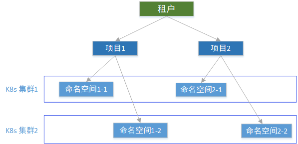
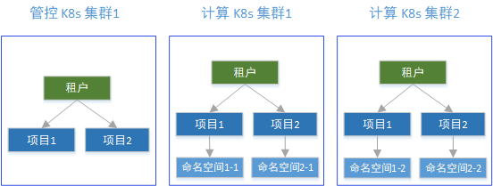
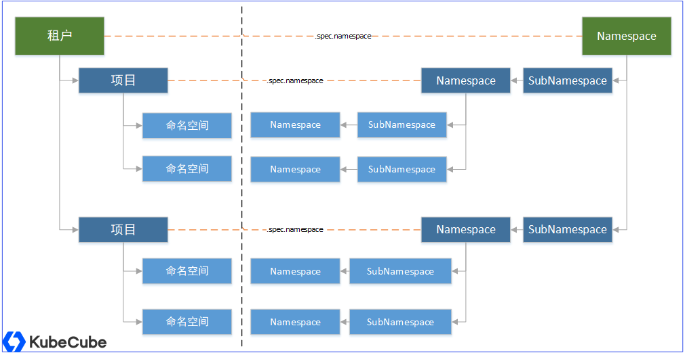
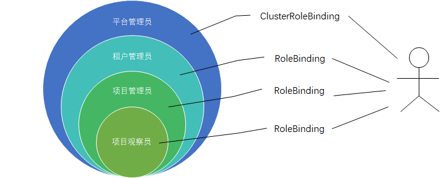
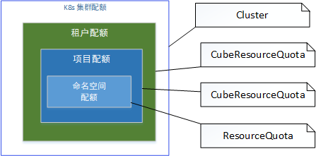

## KubeCube 多级租户模型

> KubeCube (https://kubecube.io) 是由网易数帆近期开源的一个轻量化的企业级容器平台，为企业提供 kubernetes 资源可视化管理以及统一的多集群多租户管理功能。KubeCube 社区将通过系列技术文章解读 KubeCube 的设计特点和技术实现，帮助开发者和用户更快地理解和上手 KubeCube。本文是第二篇，深度解读 KubeCube 的多级租户模型设计。

### 背景

在我们跟企业交流时，发现不同企业虽然规模不一样，但选择进⾏容器化的初衷还是为了降本增效、很多企业会选择多个部⻔共⽤ K8s 集群或者物理资源，在共享资源的同时，希望有⾜够的隔离性。

多租户是一种软件架构技术，可以实现多个租户之间资源复用和共享基础设施，方便运营管理，有效节省开发应用成本；同时又可以实现个性化定制，每个租户的数据是隔离的。

当前大部分云供应商都提供了多租户的解决方案来实现 K8s 资源共享和隔离，以满足企业不同组织架构共享一个 K8s 基础设施的需求。我们将容器服务在以往企业落地实施过程中的经验进行了总结，去数据库化采用更轻量更原生的 CRD + Operator 机制，在传统多租户模型基础上加入了项目层级与软件管理过程相对应，形成了新的多级租户模型，适配企业组织架构和软件资源管理的规范，使得企业可以更好的建立统一的多 K8s 集群管理平台。

### 租户模型介绍

KubeCube 的多级租户模型通过租户和项目实现权限隔离和资源分配。一个租户表示一个组织（部门、团队），做资源隔离。一个项目通常可以表示一个完整业务应用系统，与企业的软件项目管理过程相对应，可以根据业务系统功能分解拆分多个命名空间管理应用子系统。

租户和项目都是跨集群的概念，所有租户共享多套 K8s 集群基础设施，通过权限限定和配额管理保证必要的隔离，防止恶意操作带来的风险。

### 多级租户模型设计

KubeCube 多级租户模型提供租户、项目、空间 3 层模型以满足不同规模企业的组织架构层级，从架构上看是一种**层级树形结构**，一个租户包含多个项目，一个项目包含多个命名空间，项目包含的命名空间可以位于不同的 K8s 集群。这里的命名空间指的是 K8s 的`Namespace`，用于实际承接业务应用的部署，是管理的最小单元。 

租户和项目在实现上是一个 CRD ，用户只需要在管控 K8s 集群上创建租户和项目的 CR，KubeCube会将租户和项目的 CR 实时同步到所有的计算 K8s 集群。运维人员可以集中式的管理所有的计算 K8s 集群，新增集群时会自动同步租户项目等基础信息，项目管理员只需要在任一 K8s 集群（包括管控和计算集群）创建命名空间即可。

**租户、项目和命名空间三者之间的关联关系是通过层级命名空间实现的**，每一个租户都关联一个`Namespace`，每一个项目也都关联一个`Namespace`，通过租户和项目的Manifest里`.spec.namespace`字段指定关联的`Namespace`名称。租户和项目关联的命名空间与实际承载应用的命名空间不同，它是为了解决管理员仅可以在拥有权限的租户和项目下面创建命名空间而引入的一个特殊命名空间。

为了避免供应商锁定和更好的兼容原生 K8s 能力，KubeCube 的权限模型是基于 K8s 原生的 RBAC 能力实现的，我们期望项目管理员仅可以在他拥有权限的项目下面创建命名空间。假设授权给一个项目管理员`ClusterRole`定义赋予创建`Namespace`的权限，由于`Namespace`是集群级别资源，那么他将拥有超出项目范围任意创建命名空间的权限，这与我们的期望不符合。

这里我们引入 HNC （The Hierarchical Namespace Controller）的`SubNamespace`的概念，它是命名空间级别的资源，负责自动生成和控制`Namespace`的生命周期。在 KubeCube 的设计中，租户和项目管理员都没有直接创建命名空间的权限，他们通过拥有创建`SubNamespace`的权限来间接获得创建命名空间权利。`SubNamespace`是命名空间级别的资源，通过 RBAC 限制`SubNamespace`操作权限，租户管理员只能在自己租户关联的`Namespace`下创建`SubNamespace`，项目管理员只能在自己项目关联的`Namespace`下创建`SubNamespace`，再由 HNC 控制器组件根据`SubNamespace`自动创建`Namespace`，最终实现管理员仅可以在拥有权限的租户和项目下面创建命名空间的权限。

实际使用中，用户创建租户和项目的 CR 时，KubeCube 程序会自动监听并创建相应的`SubeNamespace`，再由 HNC 控制器监听并创建`Namespace`，继而将租户和项目与命名空间关联起来。

KubeCube 租户模型采用多层级命名空间的设计除了考虑权限限定能够兼容原生 K8s 的 RBAC 外，还额外考虑到一个因素是可以放置租户级的公共配置和项目级的公共配置，如针对整个项目的统一监控配置。在必要的时候，还可以指定 HNC 控制器将父级命名空间的资源复制传递到子命名空间，如用户权限绑定`RoleBinding`配置。

### 租户项目权限设计

KubeCube 多级租户模型中预设了四种角色，它们的权限由大到小分别是：

- 平台管理员：拥有最高权限，负责管理 K8s 集群，创建租户，设定角色权限和租户配额。
- 租户管理员：拥有某个租户的所有权限，主要负责租户下的项目管理。
- 项目管理员：负责在 K8s 集群上创建命名空间，部署应用，配置监控。
- 项目观察员：仅拥有项目下命名空间和资源的查询权限，可以查看应用日志和监控。

在实现上，四种角色是四个`ClusterRole`定义，使用`CluaterRoleBinding`可以给用户授予平台管理员权限，使用`RoleBinding`可以给用户授予受限的租户管理员、项目管理员和项目观察员权限。在层级命名空间结构中，授予一个用户租户管理员权限相当于在租户关联的命名空间及它所有下级命名空间下创建`RoleBinding`，同理授予一个用户项目管理员和项目观察员权限相当于在项目关联的命名空间及它所有下级命名空间下创建`RoleBinding`。

HNC 控制器组件在创建`Namespace`的时候，可以指定把`SubNamespace`所在的父命名空间的所有 `RoleBinding`信息往下复制传递。因此给用户授予租户管理员权限时只需要在指定租户关联的命名空间下创建`RoleBinding`，授权项目管理员和项目观察员权限时只需要在指定项目关联的命名空间下创建`RoleBinding`，权限绑定关系会随着命名空间的创建逐级复制下发，最终在命名空间下会拥有不同人不同角色的`RoleBinding`信息。

### 资源配额管理设计

KubeCube 的配额管理主要是针对多租户共享的 K8s 基础设施集群的资源分配，平台管理员可以为每一个租户划分每一个 K8s 集群的资源使用额度，包括 CPU、内存、磁盘和GPU的配额大小。租户管理员可以继续给项目划分配额，项目管理员可以给每一个承载应用系统的命名空间划分配额。集群信息`Cluster` （CRD）里记录着整个集群的可用配额信息，租户和项目的配额信息和已分配信息存储在`CubeResourceQuta`（CRD）里，命名空间的配额信息使用 K8s 原生`ResourceQuota`。

实际使用的时候，项目配额可以省略，如 KubeCube 默认集成的管理平台，平台管理员只需要给每一个租户划分每一个 K8s 集群的可用额度，项目管理员在每一个 K8s 集群上创建命名空间的时候都不能分配超出所属租户的资源额度。

### 总结

KubeCube 多级租户模型突破传统的容器服务多租户模式，采用租户、项目和空间的三级结构，与企业组织架构和软件管理适配，实现更细粒度的资源配额管理，满足企业统一容器平台的构建需求。以多层级命名空间为基础，租户项目权限隔离兼容原生 RBAC，使得 KubeCube 多级租户模型可以更好的兼容原生 K8s 集群，完全能够在已有 K8s 集群上进行原地升级安装 KubeCube。

作者：傅思达

更多内容请访问：https://www.kubecube.io

KubeCube技术交流群：    

